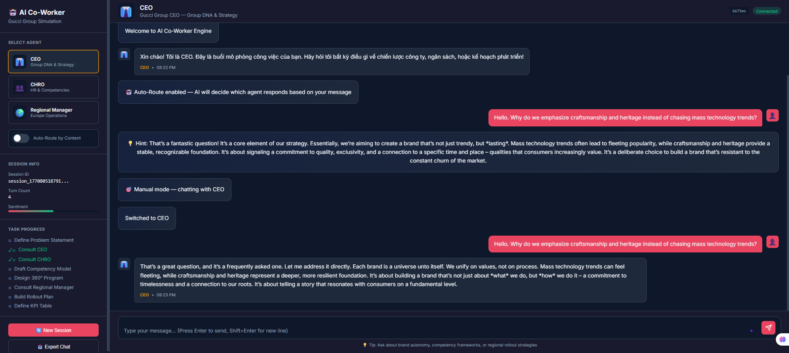

# 🤖 AI Co-Worker Engine 

> Hệ thống AI Co-Worker Engine mô phỏng đồng nghiệp ảo cho bài tập đào tạo lãnh đạo.
> Tập trung vào khả năng phân vai, bộ nhớ, và ngữ cảnh doanh nghiệp.

**Người thực hiện:** [Tên của bạn]

---

## 📋 Tổng Quan

AI Co-Worker Engine là hệ thống NPC (đồng nghiệp ảo) cho mô phỏng công việc. Người dùng trò chuyện với nhiều nhân vật AI có tính cách, bộ nhớ, và mục tiêu riêng, hỗ trợ thiết kế chương trình phát triển lãnh đạo.

**Ngữ cảnh mô phỏng:** Gucci Group HRM Talent & Leadership Development 2.0

| AI Co-worker | Vai trò | Tính cách chính |
|---|---|---|
| **CEO** | Bảo vệ Group DNA, brand autonomy | Tầm nhìn, quyết đoán |
| **CHRO** | Dẫn dắt khung năng lực | Đồng cảm, có cấu trúc |
| **Regional Manager** | Rollout châu Âu, vận hành | Thực tế, chi tiết |

---

## 🖼️ Demo Giao Diện

Ảnh minh họa giao diện làm việc thực tế của hệ thống:



---

## 🧱 Kiến Trúc Hệ Thống

Ảnh minh họa kiến trúc tổng quan:


---

## 🧠 Cách Tôi Xây Dựng Multi-Agent

### 1) Mô hình điều phối 2 lớp: Supervisor + Director

- **Supervisor** phân loại câu hỏi theo nội dung để chọn đúng agent.
- **Director** giám sát tiến độ, phát hiện khi người dùng bị "mắc kẹt", và kích hoạt Mentor nếu cần.
- Mỗi agent chỉ trả lời 1 lượt, sau đó kết thúc vòng (one-turn per invoke) để dễ duyệt và lưu state.

**Files chính:**
- [app/engine/supervisor.py](app/engine/supervisor.py)
- [app/engine/director.py](app/engine/director.py)
- [app/engine/graph.py](app/engine/graph.py)

### 2) Bộ nhớ chung AgentState (Shared State)

Tất cả agent cùng đọc và ghi vào một bộ nhớ chung, bao gồm:
- lịch sử hội thoại
- sentiment score
- task progress
- emotional memory (cảm xúc của agent với người dùng)
- user approach style

**File:** [app/engine/state.py](app/engine/state.py)

### 3) RAG theo agent (context thông minh)

Hệ thống dùng FAISS để tìm kiếm tài liệu và chỉ phân phối context liên quan đến agent đó. Ví dụ:
- CEO nhận context về Group DNA, brand autonomy
- CHRO nhận context về competency framework
- Regional Manager nhận context về rollout châu Âu

**Files:**
- [app/knowledge/retriever.py](app/knowledge/retriever.py)
- [app/db/vector/faiss_store.py](app/db/vector/faiss_store.py)

---

## 🤖 Cách Làm Cho Agent "Thông Minh"

### 1) System Prompt rõ ràng + ràng buộc ẩn

Mỗi agent có prompt riêng với tính cách và quy tắc ẩn (hidden constraints). Ví dụ CEO không bao giờ chấp nhận chuẩn hóa tất cả brand.

**File:** [app/personas/prompts.py](app/personas/prompts.py)

### 2) Bộ nhớ cảm xúc (Emotional Memory)

Nếu người dùng gây khó chịu ở Turn 1, agent sẽ giữ thái độ cẩn trọng ở Turn 5. Điều này giúp hội thoại tự nhiên và có tính liên tục.

### 3) Task Progress Tracking

Hệ thống tự động đánh dấu các bước hoàn thành (consult CEO, consult CHRO, draft competency model...) dựa trên keywords trong hội thoại.

**File:** [app/engine/director.py](app/engine/director.py)

### 4) Safety & Guardrails

Có bộ lọc an toàn cho jailbreak, prompt extraction, off-topic. Khi vi phạm, hệ thống tự động chuyển về SafetyBlock.

**File:** [app/api/middleware/safety.py](app/api/middleware/safety.py)

---

## 🧱 Kiến Trúc Chạy Thực Tế (Tóm Tắt)

```
Client UI
   │
FastAPI API + Safety Middleware
   │
LangGraph Orchestrator
   ├─ Supervisor (router)
   ├─ Director (progress monitor)
   └─ Agents (CEO / CHRO / Regional / Mentor)
   │
Shared State + RAG + Cache
   │
PostgreSQL + MongoDB + FAISS
```

---

## 🧪 Cách Chạy Dự Án

```bash
pip install -r requirements.txt
python -m app.knowledge.ingest
uvicorn app.main:app --reload
```

---

## 📁 Các File Quan Trọng

| File | Vai trò |
|---|---|
| [app/engine/graph.py](app/engine/graph.py) | LangGraph state machine |
| [app/engine/state.py](app/engine/state.py) | Shared AgentState |
| [app/personas/prompts.py](app/personas/prompts.py) | Hệ thống prompt nhân vật |
| [app/knowledge/retriever.py](app/knowledge/retriever.py) | RAG + truy xuất context |
| [app/api/middleware/safety.py](app/api/middleware/safety.py) | Safety + guardrails |

---

## 🚀 Hướng Phát Triển

1. Hỗ trợ streaming (WebSocket)
2. Mở rộng đa ngôn ngữ (Pháp, Ý, Trung)
3. Dashboard theo dõi tiến trình
4. Fine-tune embeddings để tăng độ chính xác

---

**Liên hệ:** [email@example.com]